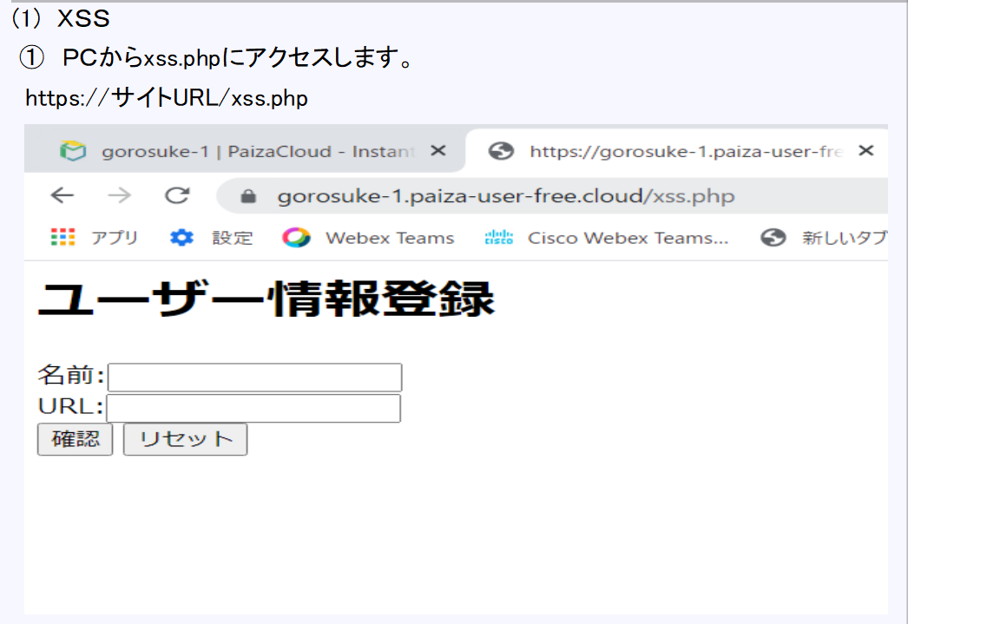
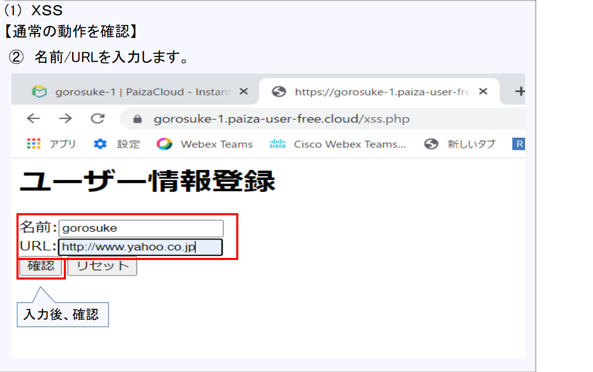

# XSSとは？？ 
  

【安全なウェブサイトの作り方 - 1.5 クロスサイト・スクリプティング】 
 https://www.ipa.go.jp/security/vuln/websecurity/cross-site-scripting.html

## XSSの種類 
 ### 反射型XSS
　ユーザが送信するHTTPリクエストパラメータをＨＴＴＰレスポンスとしてHTMLに表示してしまうもの 
 ### 格納型XSS
　Webサイトにある掲示板やコメントの機能等を利用して悪意あるスクリプトを実行できるようにするもの 
　（反射型のようなパラメータでなく、そのページを閲覧しただけで、任意のスクリプトが実行。。） 

 #### 格納型XSSのイメージ 
  

## XSSの体験 
以下のような画面遷移で動作するWebアプリケーションを例とします 

  

## 【体験要領】

### 事前準備 
異常な動作を確認します (その２）で使用する模擬悪性サイトをPythonを使用して起動しておきます 

 
 
 

### サイトの動作確認 

#### 通常の動作を確認します  
〇自身のホスト（ブラウザ）からXSS.phpにアクセスします 
〇入力フォームに名前/URLを入力します 
　　名前:gorosuke  URL：http://www.yahoo.co.jp 
〇入力した情報を確認し登録を実施します 
〇登録された旨が表示されます 

 
 
 
 

#### 異常な動作を確認します（その１） 
〇自身のホスト（ブラウザ）からXSS.phpにアクセスします 
〇スクリプトが実行可能かを確認します 
〇”Cookie情報を表示するスクリプト”を入力し、実行します 
 

#### 異常な動作を確認します (その２） 

〇自身のホスト（ブラウザ）からXSS.phpにアクセスします 
〇”模擬悪性サイトにCookie情報情報を転送するスクリプト”を入力し、実行します 

### パケットとログを確認してみましょう！！ 
 

cyber chefを使用してパケットとログをデコードします！ 
https://gchq.github.io/CyberChef/ 

#### [おさらい]エンコードとは？？ 

 
 
 

cyber chefを使用してURLエンコードされた場所をデコードします！ 
 

 

 

 

 

[目次に戻る](./README.md)  

